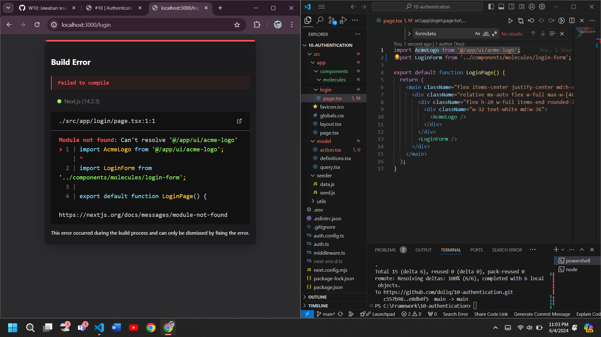

## Getting Started

First, run the development server:

```bash
npm run dev
# or
yarn dev
# or
pnpm dev
# or
bun dev
```

## Laporan Praktikum - 06

|       | Pemrograman Berbasis Framework 2024 |
| ----- | ----------------------------------- |
| NIM   | 2141720222                          |
| Nama  | Diwa Arsyad Atthoriq                |
| Kelas | TI - 3A                             |

## Praktikum 1

# Soal 1


Capture hasil deploy project Saya dan buatlah laporan di file README.md. Jelaskan apa yang telah Saya pelajari?

Jangan lupa push dengan pesan commit: "W09: Jawaban soal 1".

# Jawab

Integrasi dengan Vercel dan GitHub:

Continuous Deployment: Mengatur integrasi antara GitHub dan Vercel untuk memastikan bahwa setiap perubahan yang dilakukan pada repository otomatis diterapkan ke deployment di Vercel.

Deployment Pipelines: Memahami bagaimana pipeline deployment bekerja di Vercel dan bagaimana proses build dan deploy dilakukan.

# Soal 2

Capture hasil basis data Saya dan buatlah laporan di file README.md. Jelaskan apa yang telah Saya pelajari?

Jangan lupa push dengan pesan commit: "W09: Jawaban soal 2".

# Jawab


Konfigurasi dan Pengaturan Database:

Pilihan Database: Memilih jenis database yang tepat untuk proyek Saya (misalnya, PostgreSQL, MySQL, MongoDB).
Koneksi ke Database: Mempelajari cara mengatur dan mengkonfigurasi koneksi ke database dari aplikasi Saya yang di-host di Vercel.

Environment Variables: Mengelola environment variables untuk menyimpan informasi sensitif seperti kredensial database dengan aman.

# Soal 3

Capture hasil npm run seed Saya dan buatlah laporan di file README.md. Jelaskan apa yang telah Saya pelajari ?

Jangan lupa push dengan pesan commit: "W09: Jawaban soal 3".

# Jawab



Penulisan dan Pelaksanaan Skrip Seeder:

Skrip Seeder: Saya telah belajar cara menulis skrip seeder yang bertanggung jawab untuk memasukkan data awal ke dalam tabel-tabel di database Saya. Dalam contoh ini, Saya memiliki file seed.js yang melakukan tugas ini.

Konfigurasi Environment: Menggunakan modul dotenv untuk mengkonfigurasi environment variables yang mungkin diperlukan dalam skrip seeder.
Pembuatan dan Pengisian Tabel Database:

Pembuatan Tabel: Saya telah mempelajari cara membuat tabel dalam database melalui skrip seeder. Tabel-tabel yang dibuat termasuk users, customers, invoices, dan revenue.

Pengisian Data: Setelah tabel dibuat, Saya mengisi tabel-tabel tersebut dengan data awal (seeding). Jumlah data yang diisi untuk masing-masing tabel juga tercantum (misalnya, 1 user, 10 customers, 15 invoices, dan 12 revenue).

# Soal 4

Capture hasil query Anda dan buatlah laporan di file README.md. Jelaskan apa yang telah Anda pelajari ? Cobalah eksekusi query SQL yang lain sesuai kreasi Anda, capture hasilnya dan jelaskan!

Jangan lupa push dengan pesan commit: "W09: Jawaban soal 4".

# Jawab


Implementasi query pada vercel dan menyesuaikan data dengan seed pada seed.js

## Soal 5

Lakukan push, kemudian perhatikan di akun dashboard Vercel project Anda. Capture dan lampirkan link aplikasi Anda yang telah berhasil di deploy, kemudian buatlah laporan di file README.md. Jelaskan apa yang telah Anda pelajari ?

Jangan lupa push dengan pesan commit: "W09: Jawaban soal 5".

## Jawab

Cara bagaimana melakukan deployment aplikasi ke Vercel menggunakan GitHub dan bagaimana menyusun struktur folder.

dashboard Vercel untuk melihat proses deploy dan mengambil link aplikasi yang telah berhasil di-deploy.

Penerapan langkah-langkah di atas pada Vercel membantu memahami bagaimana workflow deployment berlangsung


## Soal 6

Lakukan capture dan push hasilnya, kemudian buatlah laporan di file README.md. Jelaskan apa yang telah Anda pelajari ?

Jangan lupa push dengan pesan commit: "W09: Jawaban soal 6".

Cara menampilkan revenue chart


## Soal 7

Lakukan capture dan push hasilnya, kemudian buatlah laporan di file README.md. Jelaskan apa yang telah Anda pelajari ?

Jangan lupa push dengan pesan commit: "W09: Jawaban soal 7".

## Jawab

Cara menampilkan latest invoice dan penambahan gambar lokal agar aset gambar yang kosong diisi


## Tugas Praktikum

## 6. Tugas Praktikum

1. Jika Anda perhatikan pada file src\app\page.tsx untuk komponen Card sebenarnya telah dibuat sebagai molecules pada file src\app\components\molecules\card.tsx yaitu komponen CardWrapper. Silakan Anda sesuaikan sehingga dapat tampil seperti gambar berikut.
   

2. Perhatikan fungsi fetchCardData() (pada file src\model\query.tsx) dari soal nomor 1. Jelaskan maksud kode dan kueri yang dilakukan dalam fungsi tersebut!

Kode dalam fungsi fetchCardData() biasanya terdiri dari proses berikut:

- Membuat permintaan ke API atau database dengan menggunakan metode seperti fetch atau axios.
- Mengirim kueri (query) yang berisi informasi terkait data yang ingin diambil, seperti ID kartu atau parameter pencarian lainnya.
- Menangani respons dari sumber data, yang biasanya berupa objek JSON atau array data.
- Memeriksa dan memanipulasi data sesuai kebutuhan aplikasi, seperti menyaring, mengurutkan, atau mengubah format data.
- Mengembalikan data kartu yang sudah diolah agar dapat digunakan di komponen atau bagian lain dari aplikasi.


