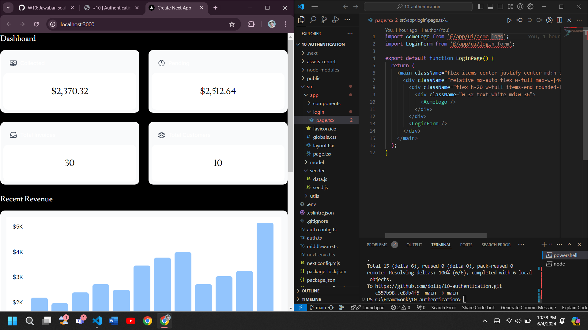
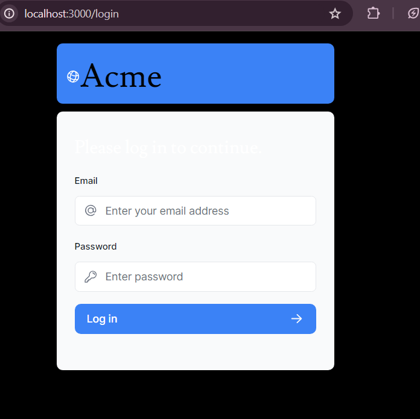

## Getting Started

First, run the development server:

```bash
npm run dev
# or
yarn dev
# or
pnpm dev
# or
bun dev
```

## Laporan Praktikum - 10

|       | Pemrograman Berbasis Framework 2024 |
| ----- | ----------------------------------- |
| NIM   | 2141720222                          |
| Nama  | Diwa Arsyad Atthoriq                |
| Kelas | TI - 3A                             |

## Praktikum 1

# Soal 1

Coba running di localhost, capture hasilnya dan buatlah laporan di README.md. Jelaskan apa yang telah Anda pelajari dan bagaimana tampilannya saat ini? Apakah ada error ?

Jangan lupa push dengan pesan commit: "W10: Jawaban soal 1".

# Jawab



Praktikum ini mengajarkan cara mengimplementasikan otentikasi di aplikasi Next.js menggunakan NextAuth.js, mulai dari membuat halaman login, mengonfigurasi NextAuth.js, menggunakan middleware untuk melindungi route, hingga mengamankan data pengguna dengan hashing password menggunakan bcrypt dan validasi input menggunakan library zod.

# Soal 2

pture hasil form login yang telah dibuat dan buatlah laporan di README.md.

Jangan lupa push dengan pesan commit: "W10: Jawaban soal 2".

# Jawab


Dari langkah-langkah ini, kita mempelajari cara menghubungkan logika autentikasi dengan formulir login menggunakan fungsi authenticate, cara membuat formulir login di Next.js dengan useFormState dan useFormStatus untuk menangani error dan status formulir, serta cara membuat komponen atom button yang dapat digunakan kembali.

# Soal 3

Silakan save semua dan lakukan running di browser Anda. Capture hasilnya dan buatlah laporan di README.md.


1. Apakah ada error atau fitur yang belum berfungsi ? jika belum, silakan perbaiki!
2. Apakah ketika mengakses path URL root ( / ) dialihkan ke halaman login ? jika belum, silakan perbaiki!
   Jangan lupa push dengan pesan commit: "W10: Jawaban soal 3".

# Jawab



Praktikum ini mengajarkan cara menambahkan fungsionalitas logout di aplikasi Next.js menggunakan NextAuth.js. Langkah-langkahnya meliputi membuat komponen `SideNav` yang memanggil fungsi `signOut`, membuat komponen `NavLinks` untuk navigasi, dan membuat komponen `AcmeLogo`. Hasilnya, pengguna dapat masuk dan keluar dari aplikasi menggunakan kredensial yang diberikan.
